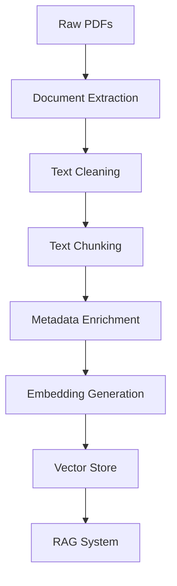

## Overview

A RAG system is only as good as its knowledge base. The data pipeline transforms raw medical documents into a searchable vector store that enables fast, semantically-aware retrieval.

<Note>
**Pipeline Goal**

Convert unstructured medical PDFs into semantically searchable chunks with rich metadata, stored in a vector database for efficient retrieval.
</Note>

## Pipeline Architecture



---

## Stage 1: Raw Documents

### Source Material

The Obstetrics RAG Benchmark uses clinical practice guidelines for pregnancy and childbirth:

- **Document**: Guía de Práctica Clínica para el cuidado prenatal
- **Format**: PDF documents with text and tables
- **Language**: Spanish (medical terminology)
- **Size**: Multiple pages of dense medical content

### Storage Structure

```bash
data/
├── raw/                     # Original PDF files
│   └── guia_embarazo.pdf   # Prenatal care guidelines
├── processed/               # Extracted text
│   └── guia_embarazo.txt   # Clean text extraction
├── chunks/                  # Processed chunks
│   └── chunks_final.json   # Chunked documents with metadata
└── embeddings/              # Vector store
    └── chroma_db/          # ChromaDB persistent storage
```

---

## Stage 2: Document Extraction

### Text Extraction Process

PDF documents are parsed to extract text content while preserving structure:

```python
import PyPDF2

def extract_text_from_pdf(pdf_path):
    """
    Extract text from PDF, preserving page structure.
    """
    with open(pdf_path, 'rb') as file:
        pdf_reader = PyPDF2.PdfReader(file)
        
        documents = []
        for page_num, page in enumerate(pdf_reader.pages):
            text = page.extract_text()
            documents.append({
                'text': text,
                'page_number': page_num + 1,
                'source': pdf_path
            })
    
    return documents
```

### Challenges Addressed

<AccordionGroup>
  <Accordion title="Multi-column layouts" icon="columns">
    Medical documents often use multi-column layouts. Extraction preserves reading order to maintain coherence.
  </Accordion>
  
  <Accordion title="Tables and lists" icon="table">
    Clinical guidelines contain structured data (dosage tables, recommendation lists). These are extracted while maintaining relationships.
  </Accordion>
  
  <Accordion title="Headers and footers" icon="bars">
    Page numbers, headers, and footers are identified and handled appropriately to avoid noise.
  </Accordion>
  
  <Accordion title="Special characters" icon="language">
    Medical terminology includes special characters and accented text (Spanish). Proper encoding ensures correct representation.
  </Accordion>
</AccordionGroup>

---

## Stage 3: Text Cleaning

### Preprocessing Steps

Extracted text undergoes cleaning to improve retrieval quality:

1. **Whitespace normalization**: Remove excessive spaces and newlines
2. **Special character handling**: Preserve medical symbols, remove artifacts
3. **Encoding fixes**: Ensure proper UTF-8 encoding
4. **Paragraph reconstruction**: Merge split paragraphs from PDF extraction
5. **Reference cleanup**: Handle citations and footnotes appropriately

```python
import re

def clean_text(text):
    """
    Clean extracted text for better chunk quality.
    """
    # Normalize whitespace
    text = re.sub(r'\s+', ' ', text)
    
    # Remove page artifacts
    text = re.sub(r'\f', '', text)  # Form feeds
    
    # Fix common PDF extraction issues
    text = text.replace('\x00', '')
    
    # Normalize line breaks
    text = re.sub(r'(?<!\n)\n(?!\n)', ' ', text)
    text = re.sub(r'\n{3,}', '\n\n', text)
    
    return text.strip()
```

### Quality Checks

- **Character validation**: Ensure no corrupted characters
- **Language detection**: Verify Spanish content
- **Length validation**: Flag suspiciously short/long pages
- **Encoding verification**: Check for mojibake and encoding errors

---

## Stage 4: Text Chunking

### Why Chunking Matters

LLMs have context limits, and retrieval systems need focused, relevant pieces of information. Chunking breaks documents into semantic units that:

- Fit within embedding model limits (8,191 tokens for text-embedding-3-small)
- Capture coherent semantic concepts
- Provide focused context for answer generation
- Enable precise retrieval granularity

### Chunking Strategy

The system uses **semantic chunking with overlap**:

<CardGroup cols={2}>
  <Card title="Chunk Size" icon="ruler">
    **~500-1000 characters** per chunk
    
    Large enough for semantic coherence, small enough for focused retrieval
  </Card>
  
  <Card title="Overlap" icon="object-intersect">
    **100-200 characters** overlap
    
    Ensures context isn't lost at chunk boundaries
  </Card>
</CardGroup>

### Chunking Implementation

```python
from langchain.text_splitter import RecursiveCharacterTextSplitter

def chunk_documents(documents, chunk_size=800, chunk_overlap=150):
    """
    Split documents into overlapping chunks for optimal retrieval.
    """
    text_splitter = RecursiveCharacterTextSplitter(
        chunk_size=chunk_size,
        chunk_overlap=chunk_overlap,
        separators=["\n\n", "\n", ". ", " ", ""],
        length_function=len,
    )
    
    chunks = []
    for doc in documents:
        split_texts = text_splitter.split_text(doc['text'])
        
        for i, chunk_text in enumerate(split_texts):
            chunks.append({
                'content': chunk_text,
                'source': doc['source'],
                'page_number': doc['page_number'],
                'chunk_index': i,
                'chunk_id': f"{doc['source']}_p{doc['page_number']}_c{i}"
            })
    
    return chunks
```

### Splitting Logic

**Hierarchical separators** (in priority order):

1. **Double newlines** (`\n\n`) - Paragraph boundaries
2. **Single newlines** (`\n`) - Sentence groups  
3. **Periods** (`. `) - Sentence boundaries
4. **Spaces** (` `) - Word boundaries
5. **Characters** (`""`) - Last resort

This ensures chunks break at natural semantic boundaries rather than mid-sentence.

### Example Chunks

```json
[
  {
    "content": "Se recomienda realizar el primer control prenatal en el primer trimestre, idealmente antes de la semana 10 de gestación. El inicio temprano permite identificar factores de riesgo y establecer un plan de cuidado apropiado.",
    "source": "guia_embarazo.pdf",
    "page_number": 15,
    "chunk_index": 0,
    "chunk_id": "guia_embarazo.pdf_p15_c0"
  },
  {
    "content": "El inicio temprano permite identificar factores de riesgo y establecer un plan de cuidado apropiado. Se recomienda un programa de diez citas para primigestantes y siete citas para multíparas con embarazos de curso normal.",
    "source": "guia_embarazo.pdf",  
    "page_number": 15,
    "chunk_index": 1,
    "chunk_id": "guia_embarazo.pdf_p15_c1"
  }
]
```

Note the **overlap** between chunks: "El inicio temprano permite..." appears in both chunks, ensuring context continuity.

---

## Stage 5: Metadata Enrichment

### Why Metadata Matters

Metadata enables:
- **Source attribution**: Know where information came from
- **Filtered retrieval**: Search within specific pages or sections
- **Result ranking**: Prefer recent or authoritative sources
- **Explainability**: Show users the source of information

### Metadata Schema

```json
{
  "content": "The actual chunk text",
  "source": "guia_embarazo.pdf",
  "page_number": 15,
  "chunk_index": 0,
  "chunk_id": "guia_embarazo.pdf_p15_c0",
  "document_title": "Guía de Práctica Clínica",
  "section": "Controles prenatales",
  "date_processed": "2024-03-11"
}
```

### Metadata Uses in Retrieval

```python
# Filter retrieval by source
results = vectorstore.similarity_search(
    query,
    filter={"source": "guia_embarazo.pdf"}
)

# Display sources in answers
for doc in results:
    print(f"Source: {doc.metadata['source']}, Page: {doc.metadata['page_number']}")
```

---

## Stage 6: Embedding Generation

### What Are Embeddings?

Embeddings are **dense vector representations** of text that capture semantic meaning. Similar texts have similar embeddings, enabling semantic search.

```python
# Example (simplified)
text = "Se recomienda diez controles prenatales"
embedding = [0.023, -0.145, 0.334, ...] # 1536 dimensions
```

### Embedding Model

The benchmark uses **OpenAI's text-embedding-3-small**:

<CardGroup cols={2}>
  <Card title="Dimensions" icon="cube">
    **1536 dimensions**
    
    Captures nuanced semantic relationships
  </Card>
  
  <Card title="Context Length" icon="text">
    **8191 tokens**
    
    Handles long medical passages
  </Card>
  
  <Card title="Cost" icon="dollar-sign">
    **$0.02 / 1M tokens**
    
    Very cost-effective for knowledge bases
  </Card>
  
  <Card title="Performance" icon="gauge-high">
    **SOTA multilingual**
    
    Excellent for Spanish medical text
  </Card>
</CardGroup>

### Embedding Generation Script

```python
import json
from langchain_openai import OpenAIEmbeddings
from langchain_chroma import Chroma
from langchain_core.documents import Document

def create_embeddings():
    """
    Generate embeddings and store in ChromaDB.
    """
    # Load chunks
    with open('data/chunks/chunks_final.json', 'r') as f:
        chunks = json.load(f)
    
    # Convert to Document objects
    documents = [
        Document(page_content=chunk['content'], metadata=chunk)
        for chunk in chunks
    ]
    
    print(f"Generating embeddings for {len(documents)} chunks...")
    
    # Initialize embeddings
    embeddings = OpenAIEmbeddings(model="text-embedding-3-small")
    
    # Create vector store
    vectorstore = Chroma.from_documents(
        documents=documents,
        embedding=embeddings,
        collection_name="guia_embarazo_parto",
        persist_directory="data/embeddings/chroma_db"
    )
    
    print(f"Vector store created with {vectorstore._collection.count()} documents")
    return vectorstore
```

**Run the script:**

```bash
python scripts/create_embeddings.py
```

**Output:**
```
Generating embeddings for 324 chunks...
Vector store created with 324 documents
Embeddings saved to data/embeddings/chroma_db/
```

### Embedding Process

1. **Batch Processing**: Chunks are embedded in batches for efficiency
2. **API Calls**: Text sent to OpenAI API for embedding generation
3. **Vector Storage**: Embeddings stored alongside original text and metadata
4. **Indexing**: Vector store creates efficient search indices

---

## Stage 7: ChromaDB Vector Store

### Why ChromaDB?

ChromaDB is an **open-source vector database** optimized for embedding storage and retrieval:

<AccordionGroup>
  <Accordion title="Persistent Storage" icon="floppy-disk">
    Embeddings are saved to disk and persist between runs. No need to regenerate embeddings each time.
  </Accordion>
  
  <Accordion title="Fast Similarity Search" icon="magnifying-glass">
    Uses HNSW (Hierarchical Navigable Small World) algorithm for efficient approximate nearest neighbor search.
  </Accordion>
  
  <Accordion title="Metadata Filtering" icon="filter">
    Supports filtering results by metadata (e.g., source, page number) before or during search.
  </Accordion>
  
  <Accordion title="Collection Management" icon="folder">
    Organize embeddings into collections (e.g., different document sets).
  </Accordion>
</AccordionGroup>

### Vector Store Structure

```bash
data/embeddings/chroma_db/
├── chroma.sqlite3              # Metadata database
└── [UUID]/                     # Collection data
    ├── data_level0.bin         # Vector indices
    ├── header.bin              # Collection header
    ├── length.bin              # Document lengths
    └── link_lists.bin          # HNSW graph
```

### Retrieval Operations

**Similarity Search:**

```python
# Find 5 most similar chunks
results = vectorstore.similarity_search(
    "¿Cuántos controles prenatales se recomiendan?",
    k=5
)

for doc in results:
    print(f"Content: {doc.page_content[:100]}...")
    print(f"Source: {doc.metadata['source']}, Page: {doc.metadata['page_number']}")
```

**Similarity Search with Scores:**

```python
# Get similarity scores
results = vectorstore.similarity_search_with_score(
    "¿Cuántos controles prenatales se recomiendan?",
    k=5
)

for doc, score in results:
    distance = score  # Lower is better (cosine distance)
    similarity = 1 - distance
    print(f"Similarity: {similarity:.3f}")
    print(f"Content: {doc.page_content[:100]}...\n")
```

**Filtered Search:**

```python
# Search only specific pages
results = vectorstore.similarity_search(
    "riesgo psicosocial",
    k=3,
    filter={"page_number": {"$gte": 10, "$lte": 20}}
)
```

---

## Pipeline Execution

### One-Time Setup

The data pipeline is typically run once to create the vector store:

```bash
# 1. Place raw PDFs in data/raw/
cp guia_embarazo.pdf data/raw/

# 2. Process documents (extraction, chunking)
python scripts/process_documents.py

# 3. Generate embeddings and create vector store
python scripts/create_embeddings.py
```

### Verification

Check that the pipeline completed successfully:

```python
from langchain_chroma import Chroma
from langchain_openai import OpenAIEmbeddings

embeddings = OpenAIEmbeddings(model="text-embedding-3-small")
vectorstore = Chroma(
    persist_directory="data/embeddings/chroma_db",
    embedding_function=embeddings,
    collection_name="guia_embarazo_parto"
)

print(f"Total documents: {vectorstore._collection.count()}")

# Test retrieval
results = vectorstore.similarity_search("controles prenatales", k=3)
print(f"\nTest query returned {len(results)} results")
for doc in results:
    print(f"- {doc.page_content[:80]}...")
```

**Expected output:**
```
Total documents: 324

Test query returned 3 results
- Se recomienda realizar el primer control prenatal en el primer trimestre...
- El número de controles prenatales depende del riesgo de la gestante...
- Para una mujer multípara con embarazo de curso normal se recomienda...
```

---

## Pipeline Optimization

### Chunking Strategy Tuning

<CardGroup cols={2}>
  <Card title="Smaller Chunks" icon="down">
    **Pros**: More precise retrieval, better for specific facts
    
    **Cons**: May lose context, requires higher k for coverage
  </Card>
  
  <Card title="Larger Chunks" icon="up">
    **Pros**: More context per chunk, fewer retrieval calls
    
    **Cons**: Less precise, may include irrelevant information
  </Card>
</CardGroup>

**Experimentation:**

```python
# Small chunks (precise)
chunks_small = chunk_documents(docs, chunk_size=400, chunk_overlap=50)

# Medium chunks (balanced) - DEFAULT
chunks_medium = chunk_documents(docs, chunk_size=800, chunk_overlap=150)

# Large chunks (contextual)
chunks_large = chunk_documents(docs, chunk_size=1500, chunk_overlap=300)
```

The benchmark uses **medium chunks (800 chars)** as the optimal balance for medical Q&A.

### Embedding Model Selection

| Model | Dimensions | Cost | Performance | Best For |
|-------|------------|------|-------------|----------|
| text-embedding-3-small | 1536 | $0.02/1M | Excellent | Most use cases (DEFAULT) |
| text-embedding-3-large | 3072 | $0.13/1M | Best | Maximum quality |
| text-embedding-ada-002 | 1536 | $0.10/1M | Good | Legacy systems |

The benchmark uses **text-embedding-3-small** for the best cost-performance ratio.

---

## Data Quality Considerations

<Warning>
**Garbage In, Garbage Out**

RAG quality is fundamentally limited by knowledge base quality. Poor chunking, noisy text, or incomplete extraction will degrade retrieval performance no matter how sophisticated the RAG architecture.
</Warning>

### Quality Checklist

- ✓ **Clean extraction**: No corrupted characters or encoding issues
- ✓ **Semantic chunks**: Chunks break at natural boundaries
- ✓ **Appropriate size**: Not too small (fragments) or too large (unfocused)
- ✓ **Sufficient overlap**: Context preserved across chunk boundaries
- ✓ **Rich metadata**: Enable filtering and source attribution
- ✓ **Complete coverage**: All relevant information from source docs
- ✓ **Consistent format**: Standardized structure across chunks

---

## Next Steps

<CardGroup cols={2}>
  <Card title="RAG Architectures" icon="sitemap" href="/concepts/rag-architectures">
    See how different retrieval strategies use this vector store
  </Card>
  
  <Card title="Running Evaluations" icon="play" href="/guides/running-evaluations">
    Evaluate RAG performance with your vector store
  </Card>
  
  <Card title="Customizing Data" icon="wrench" href="/guides/custom-datasets">
    Add your own medical documents to the knowledge base
  </Card>
  
  <Card title="Troubleshooting" icon="stethoscope" href="/troubleshooting/common-issues">
    Resolve common data pipeline issues
  </Card>
</CardGroup>